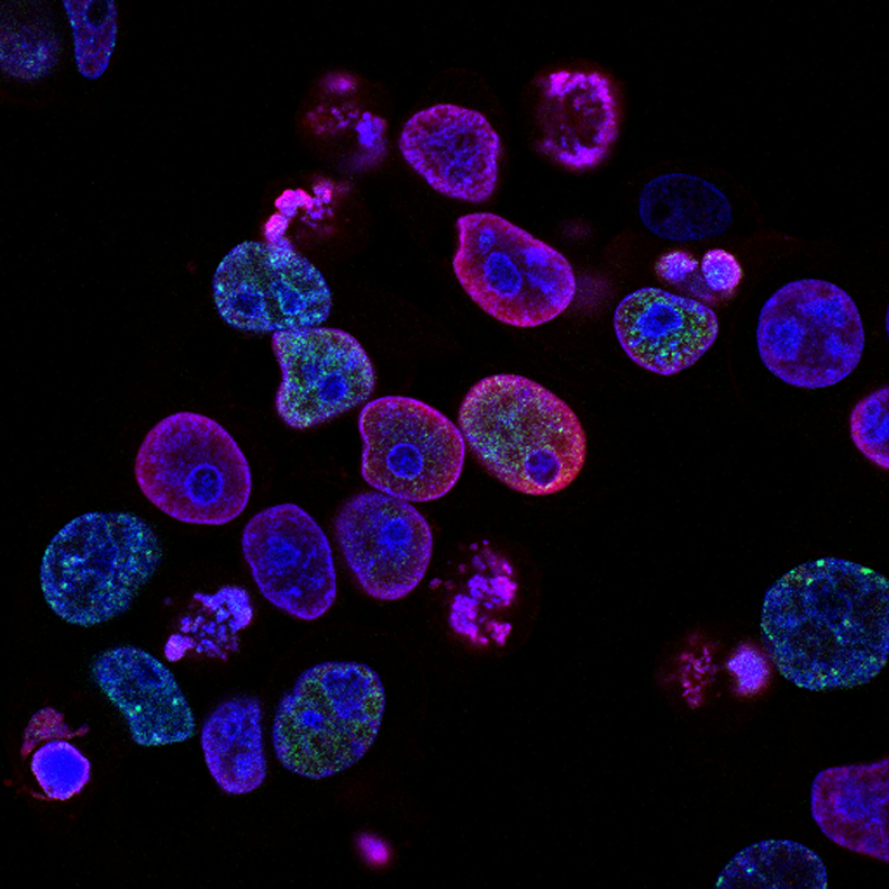

# Dhruv Aditya Srivastava, Ph.D.

[LinkedIn](https://shorturl.at/9SPDi) | [Google Scholar](https://shorturl.at/hYrV9) | Dhruvaditya88@gmail.com

## Professional Summary
An interdisciplinary scientist with over 12 years of international research experience in molecular biology, microbiology, and plant science. Expertise includes protein studies, RNA sequencing (RNA-seq), and advanced data analysis using R and Python. Proven ability to lead scientific projects and mentor students, with a strong publication record and numerous conference presentations. Seeking a research position in an academic setting to leverage extensive wet lab experience and computational skills to drive biological discovery.

## Education
*   **Ph.D. in Plant Science in Agriculture** - The Hebrew University of Jerusalem, Israel (2012–2018)
*   **Master of Technology in Biotechnology** - Indian Institute of Technology (IIT) Guwahati, India (2010–2012)
*   **Bachelor of Technology in Biotechnology** - National Institute of Technology (NIT) Durgapur, India (2006–2010)
*   **Post Graduate Program in Artificial Intelligence and Machine Learning** - The University of Texas at Austin, Texas (2023–2024)

## Research Experience
### Post-Doctoral Researcher | University of Missouri, Columbia, MO (July 2022–Present)
*   Spearheaded three successful scientific projects related to RNA-seq research techniques, including complex drought stress RNA sequencing data analysis.
*   Analyzed RNA-seq data using R and Shell scripting and performed WGCNA co-expression network analysis.
*   Conducted nutrient and carbon allocation studies using 13C labeling experiments and analyzed complex field data.
*   Mentored two graduate students, one post-graduate student, and one undergraduate student.
*   Awarded a postdoctoral grant of USD 1,500 for a project on nutrient resource allocation in mycorrhizal networks.

### Post-Doctoral Researcher | The Hebrew University of Jerusalem, Israel (October 2019–June 2022)
*   Led transcriptomic studies of fungal-plant-biocontrol interactions.
*   Developed constructs for gene knockout, RNAi silencing, and overexpression in fungi and plants.
*   Conducted protein expression and purification from E. coli and performed protein biochemical assays.
*   Extensively used molecular biology techniques including cloning (Golden Gate, Gateway), quantitative PCR, and agrobacterium-mediated transformation.

### Post-Doctoral Researcher | Volcani Center, ARO, Israel (January 2018–October 2019)
*   Deciphered pathogenicity mechanisms of phytopathogenic fungi and oomycetes using molecular and bioinformatic approaches.
*   Conducted microbiome sampling and bioinformatic analysis using QIIME.
*   Performed in vitro RNA synthesis and 18S RNA analysis.

## Skills
*   **Wet Lab & Molecular Biology**: Molecular biology, Cloning & vector construction, Nucleic acid extraction, Protein biochemistry, Protein purification, Biochemical assays, Gene knockout, RNAi silencing, Transformation (fungi, bacteria, and plants).
*   **Data Science & Bioinformatics**: R programming, Python, Shell, Data analysis, Data visualization, Machine learning, NGS analysis (RNA-seq, Microbiome), WGCNA, QIIME.
*   **Microbiology & Plant Science**: Plant-microbe interactions, Arbuscular mycorrhizae fungi, Rhizobium, Botrytis, Plant phenotyping, Field and greenhouse experiments, Confocal and fluorescence microscopy.
*   **Professional & Leadership**: Project management, Technical documentation, Mentoring graduate and undergraduate students, Proposal writing, Collaboration.

## Publications
*(Total of 11 peer-reviewed publications)*
1.  Das, D., Tripathi, S., Mutyala, P., Srivastava, D. A., & Bücking, H. (2023). Development and Resource Exchange Processes in Root Symbioses of Legumes. IntechOpen (book chapter). DOI: 10.5772/intechopen.111540
2.  Arya, G. C., Srivastava, D. A., Manasherova, E., Prusky, D. B., Elad, Y., Frenkel, O., & Harel, A. (2022). BcHnm1, a predicted choline transporter, modulates conidial germination and virulence in Botrytis cinerea. Fungal Genetics and Biology. DOI: 10.1016/j.fgb.2021.103653
3.  Srivastava, D. A., Harris, R., Breuer, G., & Levy, M. (2021). Secretion-based modes of action of biocontrol agents with a focus on Pseudozyma aphidis. Plants. DOI: 10.3390/plants10020210
4.  Srivastava, D. A., Arya, G. C., Pandaranayaka, E. P. J., Manasherova, E., Prusky, D., Elad, Y., Frenkel, O., & Harel, A. (2020). Transcriptome profiling data of Botrytis cinerea infection on whole plant Solanum lycopersicum. Molecular plant-microbe interactions (MPMI). DOI: 10.1094/MPMI-05-20-0109-A
5.  Arya, G. C., Srivastava, D. A., Pandaranayaka, E. P. J., Manasherova, E., Prusky, D., Elad, Y., Frenkel, O., Hay, D., & Harel, A. (2020). A non-GPCR membrane bound CFEM protein regulates plant pathogenicity and germination in Botrytis cinerea. Microorganisms. DOI: 10.3390/microorganisms8071043
6.  Vela-Corcía, D., Srivastava, D. A., Dafa-Berger, A., Rotem, N., Barda, O., & Levy, M. (2019). MFS transporter from Botrytis cinerea provides tolerance to glucosinolate-breakdown products and is required for pathogenicity. Nature Communications. DOI: 10.1038/s41467-019-10860-3
7.  Srivastava, D. A., Mor, M., Feldbaum, R., Tish, N., Shoyhet, H., Manasherova, E., ... & Harel, A. (2018). Multivariate analysis of diversity in Botrytis cinerea isolates from Israel. Phytoparasitica. DOI: 10.1007/s12600-018-0684-4
8.  Maayan, Y., Pandaranayaka, E. P. J., Srivastava, D. A., Lapidot, M., Levin, I., Dombrovsky, A., & Harel, A. (2018). Using genomic analysis to identify tomato Tm-2 resistance breaking mutations and their underlined evolutionary path in a new and emerging tobamovirus. Archive of Virology. DOI: 10.1007/s00705-018-3819-5
9.  Habte Nida, S. B., Zielinski, D., Srivastava, D. A., Elbaum, R., Xin, Z., Erlich, Y., ... & Shental, N. (2016). Highly efficient de novo mutant identification in a Sorghum bicolor TILLING population using the ComSeq approach. The Plant Journal. DOI: 10.1111/tpj.13161
10. Srivastava, D. A., Ben-Israel, I., Zhu, C., Nida, H., Yu, J., & Fridman, E. (2019). Heterosis association mapping for grain quality and yield related traits quantity in Sorghum bicolor di allel implicates prevalence of dominance complementation. Sorghum: Properties, Synthesis and Applications (book chapter).
11. Tamuli, R., Kumar, R., Srivastava, D. A., & Deka, R. (2013). Calcium Signaling. Neurospora: Genomics and Molecular Biology (book chapter).

## Awards & Grants
*   Awarded a postdoctoral grant of USD 1,500 for a short project proposal (December 2022).

## Conference Presentations
*   Delivered 11 talks and presented 20 posters at international conferences in Israel, USA, and Europe.
