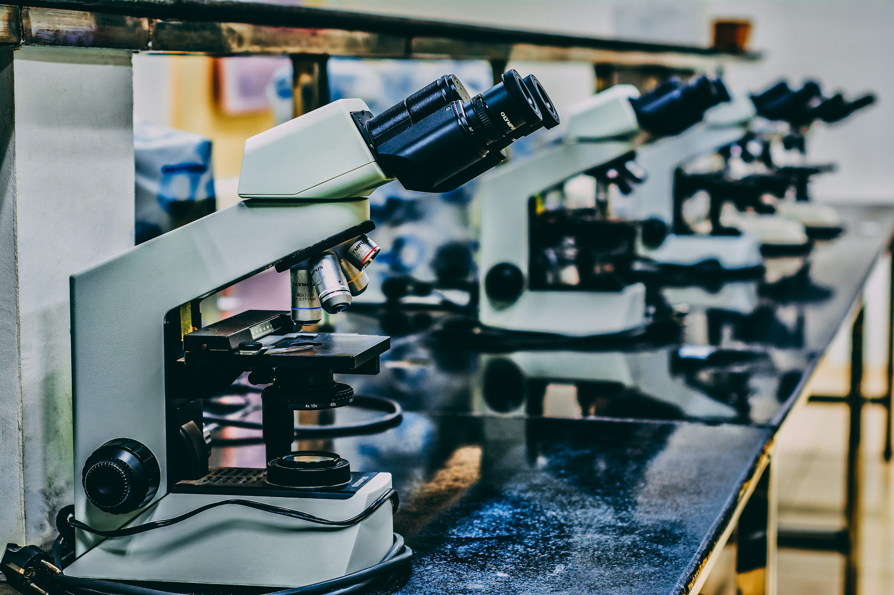

# Research Experience

### Post-Doctoral Researcher | University of Missouri, Columbia, MO (July 2022–Present)
*   Spearheaded three successful scientific projects related to RNA-seq research techniques, including complex drought stress RNA sequencing data analysis.
*   Analyzed RNA-seq data using R and Shell scripting and performed WGCNA co-expression network analysis.
*   Conducted nutrient and carbon allocation studies using 13C labeling experiments and analyzed complex field data.
*   Mentored two graduate students, one post-graduate student, and one undergraduate student.
*   Awarded a postdoctoral grant of USD 1,500 for a project on nutrient resource allocation in mycorrhizal networks.

### Post-Doctoral Researcher | The Hebrew University of Jerusalem, Israel (October 2019–June 2022)
*   Led transcriptomic studies of fungal-plant-biocontrol interactions.
*   Developed constructs for gene knockout, RNAi silencing, and overexpression in fungi and plants.
*   Conducted protein expression and purification from E. coli and performed protein biochemical assays.
*   Extensively used molecular biology techniques including cloning (Golden Gate, Gateway), quantitative PCR, and agrobacterium-mediated transformation.

### Post-Doctoral Researcher | Volcani Center, ARO, Israel (January 2018–October 2019)
*   Deciphered pathogenicity mechanisms of phytopathogenic fungi and oomycetes using molecular and bioinformatic approaches.
*   Conducted microbiome sampling and bioinformatic analysis using QIIME.
*   Performed in vitro RNA synthesis and 18S RNA analysis.

[back](./)
